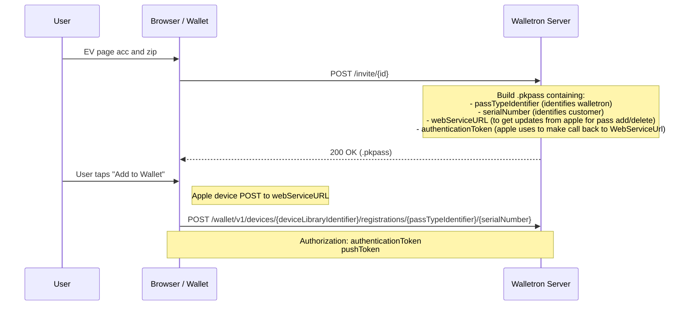

```mermaid
sequenceDiagram
    participant U as User
    participant BW as Browser / Wallet
    participant WS as Walletron Server

    U->>BW: EV page acc and zip 
    BW->>WS: POST /invite/{id} 
    
    Note over WS: Build .pkpass containing: <br/>- passTypeIdentifier (identifies walletron) <br/>- serialNumber (identifies customer) <br/>- webServiceURL (to get updates from apple for pass add/delete) <br/>- authenticationToken (apple uses to make call back to WebServiceUrl)
    
    WS-->>BW: 200 OK (.pkpass) 
    U->>BW: User taps "Add to Wallet"
    
    Note right of BW: Apple device POST to webServiceURL 
    BW->>WS: POST /wallet/v1/devices/{deviceLibraryIdentifier}/registrations/{passTypeIdentifier}/{serialNumber} 
    
    Note over BW,WS: Authorization: authenticationToken <br/>pushToken
```
