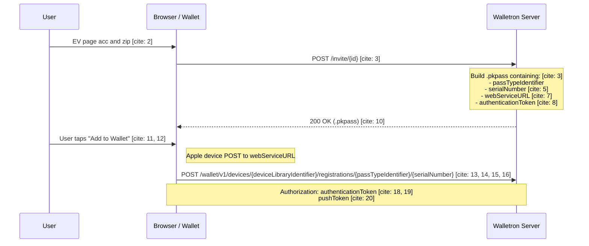

```mermaid
sequenceDiagram
    participant U as User
    participant BW as Browser / Wallet
    participant WS as Walletron Server

    U->>BW: EV page acc and zip [cite: 2]
    BW->>WS: POST /invite/{id} [cite: 3]
    
    Note over WS: Build .pkpass containing: [cite: 3]<br/>- passTypeIdentifier <br/>- serialNumber [cite: 5]<br/>- webServiceURL [cite: 7]<br/>- authenticationToken [cite: 8]
    
    WS-->>BW: 200 OK (.pkpass) [cite: 10]
    U->>BW: User taps "Add to Wallet" [cite: 11, 12]
    
    Note right of BW: Apple device POST to webServiceURL 
    BW->>WS: POST /wallet/v1/devices/{deviceLibraryIdentifier}/registrations/{passTypeIdentifier}/{serialNumber} [cite: 13, 14, 15, 16]
    
    Note over BW,WS: Authorization: authenticationToken [cite: 18, 19]<br/>pushToken [cite: 20]
```
