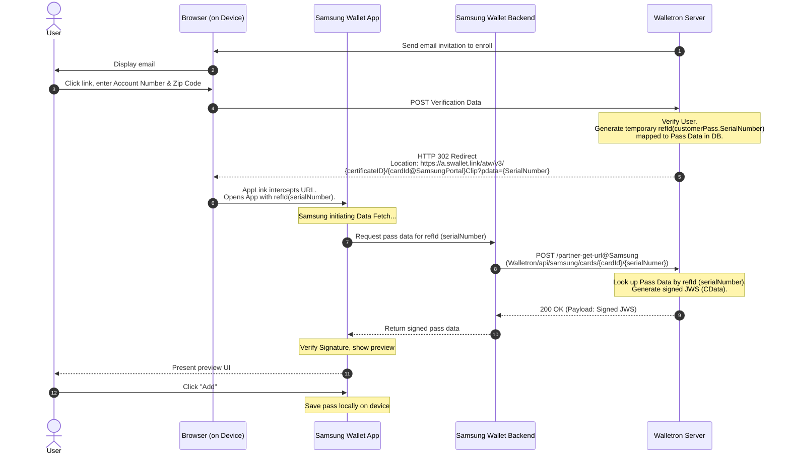

```mermaid
sequenceDiagram
    autonumber
    actor User
    participant Browser as Browser (on Device)
    participant SamsungApp as Samsung Wallet App
    participant SamsungBack as Samsung Wallet Backend
    participant Walletron as Walletron Server

    %% Steps 1 & 2: User Verification (Same as before)
    Walletron->>Browser: Send email invitation to enroll
    Browser->>User: Display email
    User->>Browser: Click link, enter Account Number & Zip Code
    Browser->>Walletron: POST Verification Data

    %% Step 3: Reference Token Generation
    Note over Walletron: Verify User.<br/>Generate temporary refId(customerPass.SerialNumber) <br/> mapped to Pass Data in DB.

    %% Step 4: Redirect with serialNumber
    Walletron-->>Browser: HTTP 302 Redirect<br/>Location: https://a.swallet.link/atw/v3/<br/>{certificateID}/{cardId@SamsungPortal}Clip?pdata={SerialNumber}

    %% Step 5: AppLink Intercept
    Browser->>SamsungApp: AppLink intercepts URL.<br/>Opens App with refId(serialNumber).

    %% Step 6: The Data Fetch (Server-to-Server)
    Note over SamsungApp: Samsung initiating Data Fetch...
    SamsungApp->>SamsungBack: Request pass data for refId (serialNumber)
    SamsungBack->>Walletron: POST /partner-get-url@Samsung <br/>(Walletron/api/samsung/cards/{cardId}/{serialNumer})
    Note over Walletron: Look up Pass Data by refId (serialNumber).<br/>Generate signed JWS (CData).
    Walletron-->>SamsungBack: 200 OK (Payload: Signed JWS)
    SamsungBack-->>SamsungApp: Return signed pass data

    %% Step 7: Save to Wallet
    Note over SamsungApp: Verify Signature, show preview
    SamsungApp-->>User: Present preview UI
    User->>SamsungApp: Click "Add"
    Note over SamsungApp: Save pass locally on device
```
    %% Step 8: Final Callback (Async Webhook)
    SamsungBack->>Walletron: POST /sendCardState API (Event: ADDED)
    Walletron-->>SamsungBack: 200 OK
